[TOC]

------


# 1 环境配置


> **硬件需要:**
>
> * kinectV1深度相机
> * turtlebot2
>
> **系统需要:**
>
> * ubuntu系统:16.04
>
> * ROS系统: kinetic
>
> * turtlebot安装包
>
> * 本课程设计代码包 turbot_ws
>
> * 安装kinect驱动(**libfreenect**+**Openni**+**Sensor**+**NITE**),需要注意的是**Sensor和Openni的版本之间是相互匹配的**,下面是我的安装参考:
>
>   > libfreenect
>   >
>   > OpenNI-Bin-Dev-Linux-x64-v1.5.7.10
>   >
>   > Sensor-Bin-Linux-x64-v5.1.2.1.tar.bz2
>   >
>   > NITE-Bin-Dev-Linux-x64-v1.5.2.23
>   >
>   > 
>
> **ROS环境变量配置:**
>
> ```shell
> sudo gedit ~/.bashrc
> #添加如下两行
> source ~/turbot_ws/devel/setup.bash
> export TURTLEBOT_3D_SENSOR=kinect
> ```
>
> 


# 2 程序执行

注意:每一次开关机前都需要重新安装一遍 mini-http (这个是我的系统原因,暂时也记录下来)

```shell
sudo dpkg -i mini-httpd_1.19-9.3_amd64.deb
# mini-httpd_1.19-9.3_amd64.deb 放在代码里面了
```


## 2.1 相关服务启动


```shell
roscore
#启动本地微服务器
rosrun rbx2_gui mini-httpd.sh
# 启动rosbridge相关(负责ROS与浏览器的交互,浏览器客户端部分)
roslaunch rbx2_gui rosbridge.launch
#启动turtlebot底层驱动
roslaunch turbot_bringup minimal.launch
# 启动二维栅格地图构建
roslaunch turbot_slam gmapping_demo.launch
```


## 2.2 浏览器遥控导航


> **获取浏览器控制地址**
>
> * 获取系统笔记本IP(指令 ifconfig)
> * 局域网下输入浏览器(最好使用谷歌)地址 `IP:8181/robot_gui.html`
> * 在下面二维地图中就可以使用鼠标点击白色区域作为目标点,开始进行自主导航
>
> 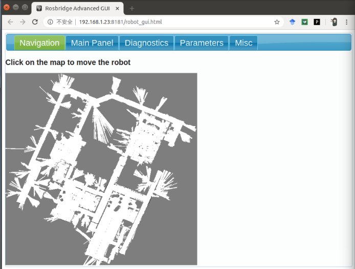


# 3 软件包简介


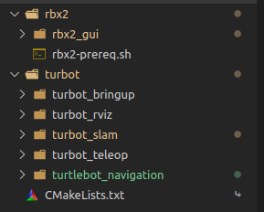


**rbx2包**

主要是负责与浏览器的交互与显示部分,内部有很多脚步语言,负责浏览器交互网页设计以及可视化ROS话题消息,

其中 `rbx2_gui/robot_gui.html`是我们最终要访问的浏览器控制网页原型.


**turbot文件夹**

turbot_bringup: 负责turtlebot2的底层驱动

turbot_slam: 负责构建二维导航地图并发布出去

turbot_navigation: 负责导航路径规划

turbot_telep: 只是在调试地图的时候使用,主要功能就是按键控制turbot2进行移动


# 4 调用流程图


各个launch文件的调用顺序如下,以及对应的launch文件的主要功能


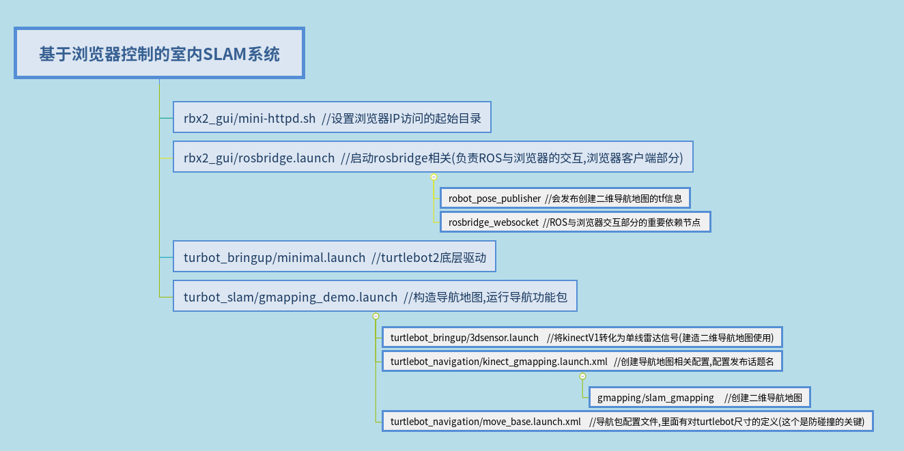


# 5 课程设计PPT


> 
>
> --------
>
> 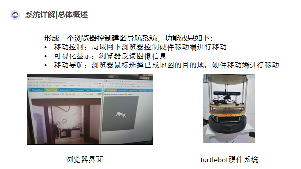
>
> ------
>
> 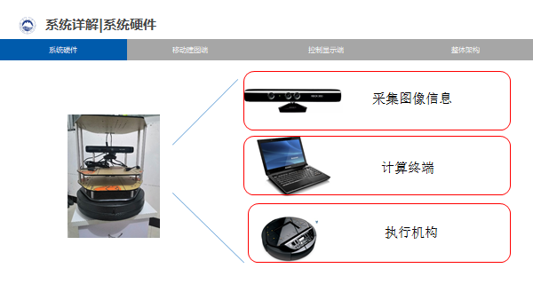
>
> ------
>
> 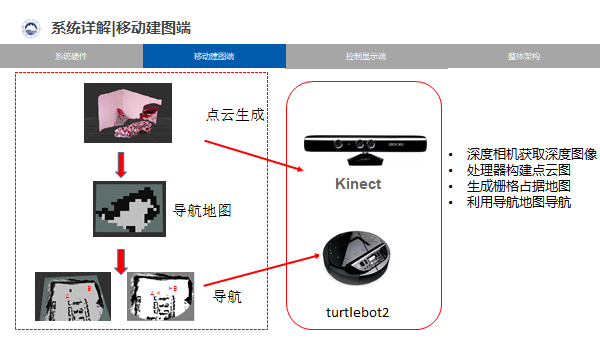
>
> -----
>
> 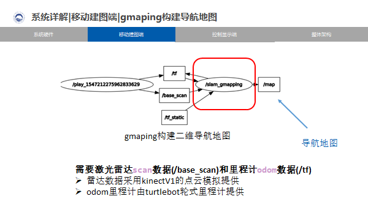
>
> --------
>
> 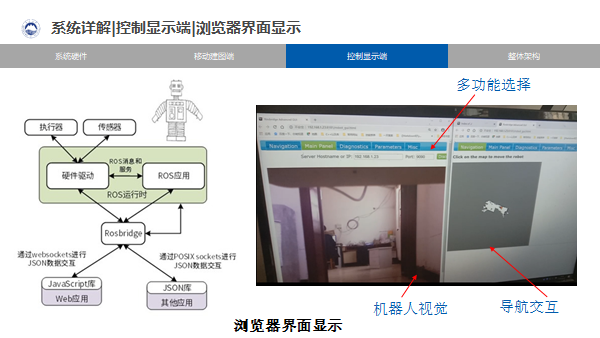
>
> --------
>
> 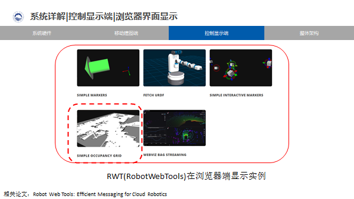
>
> -------
>
> 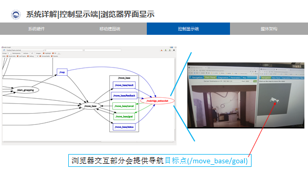
>
> -----
>
> 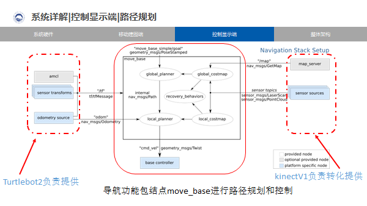
>
> -------
>
> 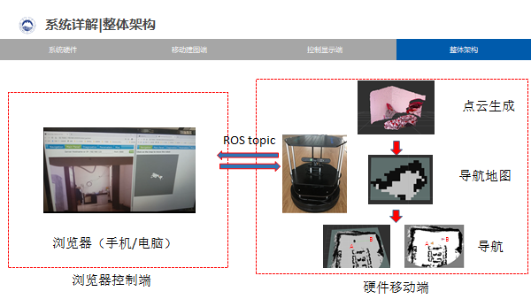
>
> -----
>
> 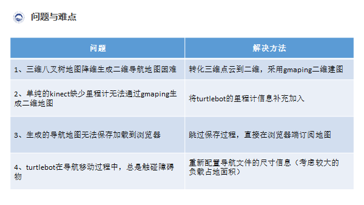


# 6 重要参考

* 浏览器端显示

http://robotwebtools.org/

* 导航功能包

http://wiki.ros.org/move_base

* 其他重要参考

https://github.com/pirobot/rbx2

https://github.com/ncnynl/turbot

